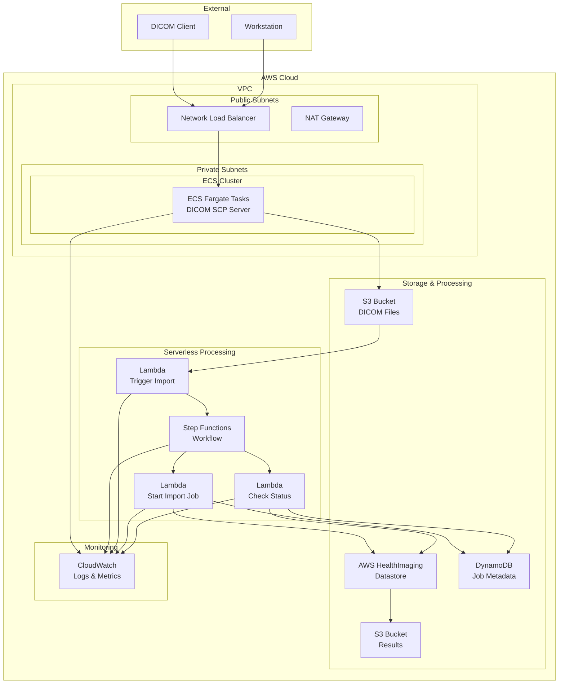

# DICOM Store SCP for AWS HealthImaging アーキテクチャ概要

## システム全体図

### アーキテクチャ図（Mermaid）



### 簡易アーキテクチャ図（テキスト）

```
◆ DICOM Client/Workstation
    │
    ↓ (DICOM Protocol)
◆ Network Load Balancer (Public Subnet)
    │
    ↓
◆ ECS Fargate Tasks (Private Subnet)
  ├─ DICOM SCP Server
  │   │
  │   ↓ (Store DICOM files)
  │ ◆ S3 Bucket (DICOM Files)
  │   │
  │   ↓ (Trigger)
  │ ◆ Lambda (Trigger Import)
  │   │
  │   ↓
  │ ◆ Step Functions Workflow
  │   ├─ Lambda (Start Import Job)
  │   │   │
  │   │   ↓
  │   │ ◆ AWS HealthImaging
  │   │   │
  │   │   ↓
  │   │ ◆ S3 Bucket (Results)
  │   │
  │   └─ Lambda (Check Status)
  │       │
  │       ↓
  │     ◆ DynamoDB (Job Metadata)
  │
  └─ CloudWatch (Logs & Metrics)
```

## コンポーネント詳細

### 1. ネットワーク層

#### Network Load Balancer (NLB)
- **目的**: DICOM通信の負荷分散とヘルスチェック
- **特徴**:
  - Layer 4（TCP）での負荷分散
  - 高可用性とスケーラビリティ
  - TLS終端対応（オプション）
- **設定**:
  - ターゲット: ECS Fargate タスク
  - ヘルスチェック: TCP接続確認
  - スティッキーセッション: 無効

#### VPC構成
```
VPC CIDR: 10.0.0.0/16

Public Subnets:
- 10.0.1.0/24 (AZ-a)
- 10.0.2.0/24 (AZ-b)

Private Subnets:
- 10.0.11.0/24 (AZ-a)
- 10.0.12.0/24 (AZ-b)
```

### 2. コンピューティング層

#### ECS Fargate
- **目的**: DICOM SCPサーバーの実行環境
- **特徴**:
  - サーバーレスコンテナ実行
  - 自動スケーリング対応
  - マネージドインフラ
- **設定**:
  - CPU: TASK_CPUパラメータで設定可能
  - Memory: TASK_MEMORY_LIMIT_MIBパラメータで設定可能
  - ネットワークモード: awsvpc

#### DICOM SCP Server
- **機能**:
  - DICOM C-STORE受信
  - AE Title検証
  - 画像データのS3保存
  - メタデータ抽出
- **プロトコル対応**:
  - DICOM 3.0準拠
  - 複数SOP Class対応
  - 圧縮転送構文対応

### 3. ストレージ層

#### S3 Bucket (DICOM Files)
- **目的**: 受信したDICOMファイルの一時保存
- **特徴**:
  - 暗号化: AES-256 (S3マネージド)
  - パブリックアクセス: ブロック
  - SSL強制: 有効
- **構造**:
  ```
  bucket-name/{YYYY}/{MM}/{DD}/{Timestamp}/{StudyInstanceUID}/{SeriesInstanceUID}/{SOPInstanceUID}.dcm
  
  StudyDateが利用可能な場合はそれを使用、そうでなければ現在の日付を使用。
  Timestampは現在のUNIX時刻を表す。
  ```

#### AWS HealthImaging
- **目的**: 医療画像の長期保存と管理
- **特徴**:
  - DICOM標準準拠
  - 高可用性・耐久性
  - API経由でのアクセス
- **データストア設定**:
  - 暗号化: AWSマネージド暗号化
  - アクセス制御: IAM
  - 監査ログ: CloudTrail（オプション）

#### S3 Bucket (Results)
- **目的**: HealthImagingからの出力結果保存
- **特徴**:
  - 処理結果のメタデータ
  - 変換ログ

#### DynamoDB
- **目的**: インポートジョブのメタデータ管理
- **テーブル設計**:
  ```
  Table: DicomImportJobTable
  ├── PK: jobId (String)
  ├── jobStatus (String)
  ├── submittedAt (String)
  ├── inputS3Uri (String)
  ├── outputS3Uri (String)
  ├── datastoreId (String)
  ├── dataAccessRoleArn (String)
  ├── studyDate (String)
  ├── studyInstanceUID (String)
  ├── seriesInstanceUID (String)
  ├── sopInstanceUID (String)
  ├── endedAt (String)
  └── message (String)
  ```

### 4. 処理ワークフロー層

#### Step Functions
- **目的**: DICOMインポート処理の統合
- **ワークフロー**:
  ```json
  {
    "StartAt": "TriggerImport",
    "States": {
      "TriggerImport": {
        "Type": "Task",
        "Resource": "arn:aws:lambda:...:function:TriggerImport",
        "Next": "StartImportJob"
      },
      "StartImportJob": {
        "Type": "Task",
        "Resource": "arn:aws:lambda:...:function:StartImportJob",
        "Next": "WaitForCompletion"
      },
      "WaitForCompletion": {
        "Type": "Wait",
        "Seconds": 30,
        "Next": "CheckStatus"
      },
      "CheckStatus": {
        "Type": "Task",
        "Resource": "arn:aws:lambda:...:function:CheckStatus",
        "Next": "IsComplete"
      },
      "IsComplete": {
        "Type": "Choice",
        "Choices": [
          {
            "Variable": "$.status",
            "StringEquals": "COMPLETED",
            "Next": "Success"
          },
          {
            "Variable": "$.status",
            "StringEquals": "FAILED",
            "Next": "Failure"
          }
        ],
        "Default": "WaitForCompletion"
      },
      "Success": {
        "Type": "Succeed"
      },
      "Failure": {
        "Type": "Fail"
      }
    }
  }
  ```

#### Lambda Functions

**1. Trigger Import Function**
- **トリガー**: S3 PUT イベント
- **処理**:
  - DICOMファイルの検証
  - メタデータ抽出
  - Step Functions実行開始

**2. Start Import Job Function**
- **処理**:
  - HealthImaging Import Job作成
  - DynamoDBにジョブ情報記録
  - ジョブIDの返却

**3. Check Status Function**
- **処理**:
  - Import Job状態確認
  - DynamoDB更新
  - 完了/エラー判定

### 5. 監視・ログ層

#### CloudWatch
- **メトリクス**:
  - ECS: CPU/Memory使用率
  - NLB: 接続数、レスポンス時間
  - Lambda: 実行回数、エラー率、実行時間
  - Step Functions: 実行状況
- **ログ**:
  - ECS: アプリケーションログ
  - Lambda: 実行ログ
  - VPC: フローログ

## データフロー

### 1. DICOM受信フロー
```
1. DICOM Client → NLB (TCP:11112)
2. NLB → ECS Fargate Task
3. ECS → DICOM Protocol Processing
4. ECS → S3 Bucket (DICOM Files)
5. S3 Event → Lambda (Trigger Import)
```

### 2. インポート処理フロー
```
1. Lambda (Trigger) → Step Functions
2. Step Functions → Lambda (Start Import Job)
3. Lambda → HealthImaging API
4. HealthImaging → Processing
5. Lambda (Check Status) → Status Polling
6. HealthImaging → S3 (Results)
7. DynamoDB ← Status Updates
```

### 3. エラーハンドリングフロー
```
1. Error Detection → CloudWatch Logs
2. DynamoDB → Error Status Update
3. Step Functions → Retry Logic
```

## セキュリティアーキテクチャ

### ネットワークセキュリティ
- **VPC分離**: パブリック/プライベートサブネット
- **セキュリティグループ**: 最小権限の原則
- **NACLs**: サブネットレベルの制御
- **TLS暗号化**: DICOM通信の暗号化（オプション）

### アクセス制御
- **IAM Roles**: サービス間の認証・認可
- **Resource-based Policies**: S3、DynamoDB等のリソースレベル制御
- **VPC Endpoints**: AWS サービスへのプライベート接続

### データ保護
- **暗号化**:
  - S3: AES-256 (SSE-S3)
  - DynamoDB: デフォルト暗号化
  - HealthImaging: AWSマネージド暗号化
- **アクセスログ**: VPC Flow Logs、CloudTrail（オプション）
- **監査**: CloudWatch、AWS Config（オプション）

## スケーラビリティ設計

### 水平スケーリング
- **ECS Auto Scaling**: CPU使用率ベース（ターゲット: 50%）
- **Lambda**: 自動スケーリング（同時実行制限設定可能）
- **DynamoDB**: オンデマンドキャパシティ（PAY_PER_REQUEST）

### 垂直スケーリング
- **ECS Task Definition**: パラメータによるCPU/メモリ設定の調整
- **Lambda**: メモリ設定による性能調整

### 可用性設計
- **Multi-AZ**: 複数のアベイラビリティゾーンに分散
- **ヘルスチェック**: NLBによる自動フェイルオーバー
- **データ保護**: S3暗号化とアクセス制御

## パフォーマンス最適化

### レイテンシ最適化
- **NLB**: Layer 4負荷分散とクロスゾーン負荷分散による低レイテンシ
- **ECS Tasks**: 複数AZのプライベートサブネットに分散配置
- **Lambda**: メモリ設定可能な自動スケーリング

### スループット最適化
- **ECS Auto Scaling**: スケールイン/アウト60秒クールダウン
- **S3**: 標準パフォーマンス（転送高速化無効）
- **DynamoDB**: 可変ワークロード向けオンデマンドキャパシティ

### コスト最適化
- **S3 Lifecycle**: 設定可能な保持ポリシー
- **ECS Fargate**: 従量課金モデル
- **DynamoDB**: 予測困難なトラフィック向けオンデマンド課金

---

このアーキテクチャにより、スケーラブルで安全、かつ高可用性なDICOM Store SCPシステムをAWS上で実現できます。