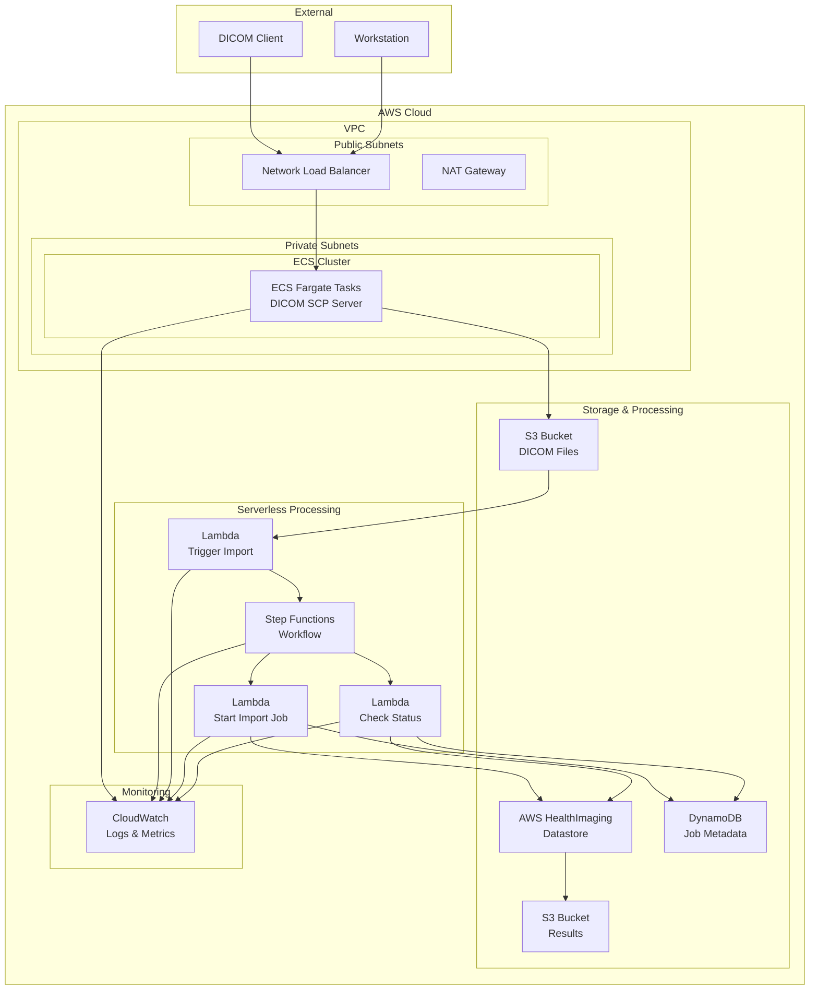

# DICOM Store SCP for AWS HealthImaging Architecture Overview

## System Architecture Diagram

### Architecture Diagram (Mermaid)



### Simplified Architecture Diagram (Text)

```
◆ DICOM Client/Workstation
    │
    ↓ (DICOM Protocol)
◆ Network Load Balancer (Public Subnet)
    │
    ↓
◆ ECS Fargate Tasks (Private Subnet)
  ├─ DICOM SCP Server
  │   │
  │   ↓ (Store DICOM files)
  │ ◆ S3 Bucket (DICOM Files)
  │   │
  │   ↓ (Trigger)
  │ ◆ Lambda (Trigger Import)
  │   │
  │   ↓
  │ ◆ Step Functions Workflow
  │   ├─ Lambda (Start Import Job)
  │   │   │
  │   │   ↓
  │   │ ◆ AWS HealthImaging
  │   │   │
  │   │   ↓
  │   │ ◆ S3 Bucket (Results)
  │   │
  │   └─ Lambda (Check Status)
  │       │
  │       ↓
  │     ◆ DynamoDB (Job Metadata)
  │
  └─ CloudWatch (Logs & Metrics)
```

## Component Details

### 1. Network Layer

#### Network Load Balancer (NLB)
- **Purpose**: Load balancing and health checking for DICOM communication
- **Features**:
  - Layer 4 (TCP) load balancing
  - High availability and scalability
  - TLS termination support (optional)
- **Configuration**:
  - Target: ECS Fargate tasks
  - Health Check: TCP connection verification
  - Sticky Sessions: Disabled

#### VPC Configuration
```
VPC CIDR: 10.0.0.0/16

Public Subnets:
- 10.0.1.0/24 (AZ-a)
- 10.0.2.0/24 (AZ-b)

Private Subnets:
- 10.0.11.0/24 (AZ-a)
- 10.0.12.0/24 (AZ-b)
```

### 2. Compute Layer

#### ECS Fargate
- **Purpose**: Execution environment for DICOM SCP server
- **Features**:
  - Serverless container execution
  - Auto-scaling support
  - Managed infrastructure
- **Configuration**:
  - CPU: Configurable via TASK_CPU parameter
  - Memory: Configurable via TASK_MEMORY_LIMIT_MIB parameter
  - Network Mode: awsvpc

#### DICOM SCP Server
- **Functions**:
  - DICOM C-STORE reception
  - AE Title validation
  - Image data storage to S3
  - Metadata extraction
- **Protocol Support**:
  - DICOM 3.0 compliant
  - Multiple SOP Class support
  - Compressed transfer syntax support

### 3. Storage Layer

#### S3 Bucket (DICOM Files)
- **Purpose**: Temporary storage for received DICOM files
- **Features**:
  - Encryption: AES-256 (S3 managed)
  - Public access: Blocked
  - SSL enforcement: Enabled
- **Structure**:
  ```
  bucket-name/{YYYY}/{MM}/{DD}/{Timestamp}/{StudyInstanceUID}/{SeriesInstanceUID}/{SOPInstanceUID}.dcm
  
  StudyDate is used if available; otherwise, the current date is used.
  Timestamp represents the current UNIX time.
  ```

#### AWS HealthImaging
- **Purpose**: Long-term storage and management of medical images
- **Features**:
  - DICOM standard compliant
  - High availability and durability
  - API-based access
- **Datastore Configuration**:
  - Encryption: AWS managed encryption
  - Access Control: IAM
  - Audit Logging: CloudTrail (optional)

#### S3 Bucket (Results)
- **Purpose**: Storage for HealthImaging output results
- **Features**:
  - Processing result metadata
  - Conversion logs

#### DynamoDB
- **Purpose**: Import job metadata management
- **Table Design**:
  ```
  Table: DicomImportJobTable
  ├── PK: jobId (String)
  ├── jobStatus (String)
  ├── submittedAt (String)
  ├── inputS3Uri (String)
  ├── outputS3Uri (String)
  ├── datastoreId (String)
  ├── dataAccessRoleArn (String)
  ├── studyDate (String)
  ├── studyInstanceUID (String)
  ├── seriesInstanceUID (String)
  ├── sopInstanceUID (String)
  ├── endedAt (String)
  └── message (String)
  ```

### 4. Processing Workflow Layer

#### Step Functions
- **Purpose**: DICOM import process orchestration
- **Workflow**:
  ```json
  {
    "StartAt": "TriggerImport",
    "States": {
      "TriggerImport": {
        "Type": "Task",
        "Resource": "arn:aws:lambda:...:function:TriggerImport",
        "Next": "StartImportJob"
      },
      "StartImportJob": {
        "Type": "Task",
        "Resource": "arn:aws:lambda:...:function:StartImportJob",
        "Next": "WaitForCompletion"
      },
      "WaitForCompletion": {
        "Type": "Wait",
        "Seconds": 30,
        "Next": "CheckStatus"
      },
      "CheckStatus": {
        "Type": "Task",
        "Resource": "arn:aws:lambda:...:function:CheckStatus",
        "Next": "IsComplete"
      },
      "IsComplete": {
        "Type": "Choice",
        "Choices": [
          {
            "Variable": "$.status",
            "StringEquals": "COMPLETED",
            "Next": "Success"
          },
          {
            "Variable": "$.status",
            "StringEquals": "FAILED",
            "Next": "Failure"
          }
        ],
        "Default": "WaitForCompletion"
      },
      "Success": {
        "Type": "Succeed"
      },
      "Failure": {
        "Type": "Fail"
      }
    }
  }
  ```

#### Lambda Functions

**1. Trigger Import Function**
- **Trigger**: S3 PUT event
- **Processing**:
  - DICOM file validation
  - Metadata extraction
  - Step Functions execution start

**2. Start Import Job Function**
- **Processing**:
  - HealthImaging Import Job creation
  - Job information recording in DynamoDB
  - Job ID return

**3. Check Status Function**
- **Processing**:
  - Import Job status check
  - DynamoDB update
  - Completion/error determination

### 5. Monitoring and Logging Layer

#### CloudWatch
- **Metrics**:
  - ECS: CPU/Memory utilization
  - NLB: Connection count, response time
  - Lambda: Execution count, error rate, execution time
  - Step Functions: Execution status
- **Logs**:
  - ECS: Application logs
  - Lambda: Execution logs
  - VPC: Flow logs

## Data Flow

### 1. DICOM Reception Flow
```
1. DICOM Client → NLB (TCP:11112)
2. NLB → ECS Fargate Task
3. ECS → DICOM Protocol Processing
4. ECS → S3 Bucket (DICOM Files)
5. S3 Event → Lambda (Trigger Import)
```

### 2. Import Processing Flow
```
1. Lambda (Trigger) → Step Functions
2. Step Functions → Lambda (Start Import Job)
3. Lambda → HealthImaging API
4. HealthImaging → Processing
5. Lambda (Check Status) → Status Polling
6. HealthImaging → S3 (Results)
7. DynamoDB ← Status Updates
```

### 3. Error Handling Flow
```
1. Error Detection → CloudWatch Logs
2. DynamoDB → Error Status Update
3. Step Functions → Retry Logic
```

## Security Architecture

### Network Security
- **VPC Isolation**: Public/Private subnet separation
- **Security Groups**: Principle of least privilege
- **NACLs**: Subnet-level control
- **TLS Encryption**: DICOM communication encryption (optional)

### Access Control
- **IAM Roles**: Inter-service authentication and authorization
- **Resource-based Policies**: Resource-level control for S3, DynamoDB, etc.
- **VPC Endpoints**: Private connection to AWS services

### Data Protection
- **Encryption**:
  - S3: AES-256 (SSE-S3)
  - DynamoDB: Default encryption
  - HealthImaging: AWS managed encryption
- **Access Logs**: VPC Flow Logs, CloudTrail (optional)
- **Auditing**: CloudWatch, AWS Config (optional)

## Scalability Design

### Horizontal Scaling
- **ECS Auto Scaling**: CPU utilization-based (target: 50%)
- **Lambda**: Automatic scaling (configurable concurrent execution limits)
- **DynamoDB**: On-demand capacity (PAY_PER_REQUEST)

### Vertical Scaling
- **ECS Task Definition**: CPU/Memory configuration adjustment via parameters
- **Lambda**: Performance tuning through memory configuration

### Availability Design
- **Multi-AZ**: Distribution across multiple Availability Zones
- **Health Checks**: Automatic failover with NLB
- **Data Protection**: S3 encryption and access controls

## Performance Optimization

### Latency Optimization
- **NLB**: Low latency with Layer 4 load balancing and cross-zone load balancing
- **ECS Tasks**: Distributed across private subnets in multiple AZs
- **Lambda**: Automatic scaling with configurable memory

### Throughput Optimization
- **ECS Auto Scaling**: 60-second cooldown for scale-in/scale-out
- **S3**: Standard performance (transfer acceleration disabled)
- **DynamoDB**: On-demand capacity for variable workloads

### Cost Optimization
- **S3 Lifecycle**: Configurable retention policies
- **ECS Fargate**: Pay-per-use pricing model
- **DynamoDB**: On-demand billing for unpredictable traffic

---

This architecture enables a scalable, secure, and highly available DICOM Store SCP system on AWS.